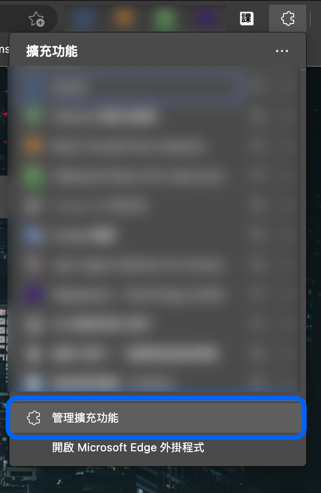
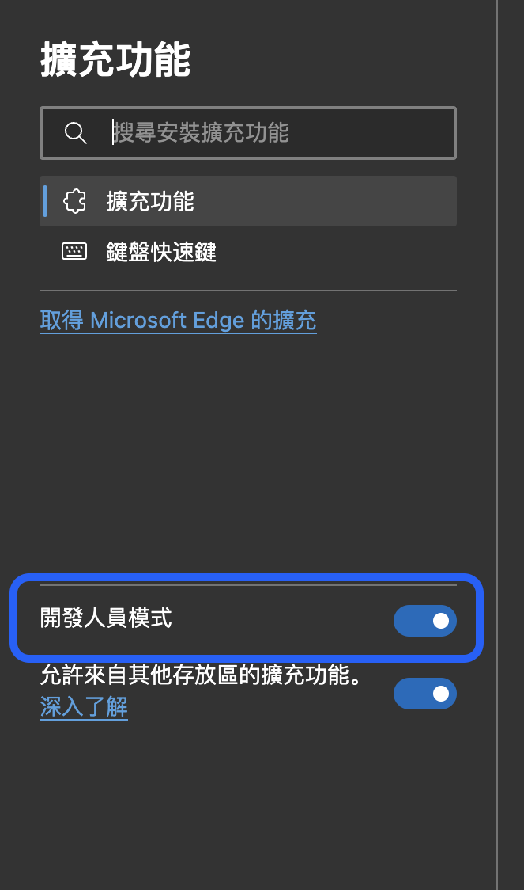

# 台大課程評價小幫手
這是一個幫台大生更方面搜集課程評價的 Chrome 擴充程式，不用另開好幾個分頁 Google，只要進入課程的個別頁面、點小工具 icon，即可快速查看 PTT、Dcard 與 NTU Rating 的課程評價！
## 目錄
- [使用框架](#使用框架)
- [Set Up](#set-up)
- [重點功能](#重點功能)
- [專案架構](#專案架構)
- [後端 API Reference](#後端-api-reference)
- [Inspiration & Thanks](#inspiration--thanks)
- [Reference](#reference)
- [License](#license)
***
## 使用框架
- Bootstrap 5.0.2
- jQuery 3.6.3
***
## Set Up
如果你想在本機端開發並測試自己的版本，可依照以下步驟，安裝到你的瀏覽器做測試：
1. 開啟瀏覽器擴充功能頁面 -> 管理擴充功能

2. 打開「 開發人員選項 」

3. 點選「 載入解壓縮 」開啟你 clone 下來的資料夾，即可完成安裝

***
## 重點功能
- 快速查看 PTT、Dcard 與 NTU Rating 的課程評價
### To do
- 新增台大課程交流 Facebook 社團資料
***
## 專案架構
- `dist/`：JS & CSS 檔案
    - `popup.js`：小工具的前端 JS
    - `popup.css`：小工具的前端 CSS
- `popup.html`：小工具的前端頁面
- `manifest.json`：小工具的 Extension 設定檔

如果你只想調整前端頁面，可沿用原本我寫的 API，然而如果你想自訂評價的來源跟資料，你可以自行建立後端 API，並調整 `dist/popup.js` 的 API 網址和對於 response 的處理。
***
## 後端 API Reference
以下是小工具後端 API 的使用說明與注意事項，供沒有要另建後端 API 的人參考：
### 取得課程資料與評價
- **URL**
    - `https://ntucourse-api.jcshawn.com/api/course/:課程流水號`
- **Method**
    - `GET`
- **Response**
    - **type**
        - `application/json`
    - **Content**
        - `success`：是否成功取得資料
        - `id`：課程流水號
        - `class_name`：課程名稱
        - `teacher`：教師名稱
        - `reviews`：評價來源：
            - `ptt`：PTT 評價 article
                - `title`：評價標題
                - `link`：評價網址
                - `snippet`：評價內容簡述
            - `dcard`：Dcard 評價
            - `ntu_rating`：NTU Rating 評價

    - **Example**
        ```
        https://ntucourse-api.jcshawn.com/api/course/68350
        ```
        ```json
        {
            "success": true,
            "id": "68350",
            "class_name": "會計學甲一下",
            "teacher": "陳坤志",
            "reviews": {
                "ptt": [
                    {
                        "title": "[評價] 105全陳坤志中級會計學- 看板NTUcourse - 批踢踢實業坊",
                        "link": "https://www.ptt.cc/bbs/NTUcourse/M.1501747221.A.1F1.html",
                        "snippet": "本文是否可提供臺大同學轉作其他非營利用途？（須保留原作者ID） （是／否／其他條件）：是哪一學年度修課：105全學年ψ 授課教師(若為多人合授請寫 ..."
                    },
                    {
                        "title": "[評價] 105全陳坤志中級會計學上下- 看板NTUcourse - 批踢踢實業坊",
                        "link": "https://www.ptt.cc/bbs/NTUcourse/M.1498716827.A.DDA.html",
                        "snippet": "本文是否可提供臺大同學轉作其他非營利用途？（須保留原作者ID） （是／否／其他條件）： 是哪一學年度修課：105-1 105-2 ψ 授課教師(若為多人合授請 ..."
                    }
                ],
                "dcard": [], // 如果沒有評價，則會是空陣列
                "ntu_rating": [
                    {
                        "title": "台大課程評價：會計學甲一上Financial Accounting (A)(I)(1) –– 想鑑你 ...",
                        "link": "https://rating.myntu.me/course-overview?_id=62e6c86644b8e1922ab54f42&instructor=陳坤志&courseName=會計學甲一上#Financial+Accounting+(A)(I)(1)",
                        "snippet": "會計學甲一上. Financial Accounting (A)(I)(1). Course Information. Instructor. 陳坤志. Latest Semester. 111-1. Department. 7011 7012 ..."
                    }
                ]
            }
        }
        ```
### API 注意事項
**Rate-limit**
-  由於後端是使用我個人 VM，規格不大，為避免影響我其他 VM 上的專案，此 API 設有 Rate-limit，對於非正常使用的請求速率會回傳 429 Error。  
      
    如果你要建立自己的 Database ，需要課程流水號、教師、與課程名稱資料，可以 email 跟我拿我爬的資料（ 我可以給你 ）***請不要透過程式頻繁呼叫後端 API 來大量取得課程資料***

**評價結果可能不準確**
- 由於評價結果是程式自動化搜集，所以可能會有資料不準確的情況，也因為 Google API 費用較貴的關係，無法收錄完整的網路評價，我只搜集前 10 筆資料。
  
  如果你發現有錯誤的資料，或是想補充，可以 [email](mailto:contact@jcshawn.com) 跟我說，我會盡快修正。
***
## Thanks
這個小工具是我應用 2022 年所學的後端而做的 side project，透過 Chrome Extension 快速建立前端頁面，並透過 Node.js 建立傳送課程資料的後端 API，達到即時更新資料的效果。  
  
特別感謝實習公司的 Guang 學長跟 William，在去年給我很多 full-stack 開發的觀念、建議跟機會，讓我在這次的 side project 中多了一個使用後端的技能。
## References
- [Google Custom Search API](https://developers.google.com/custom-search/v1/overview)

- [Google Chrome Extension Doc](https://developer.chrome.com/docs/extensions/)

- [[筆記] 從零開始製作 Chrome 套件到上架商店 - Mike Huang ](https://medium.com/麥克的半路出家筆記/筆記-從零開始製作-chrome-套件到上架商店-4971ed79ac77)
```
本專案並未使用 content script 與 background.js 這兩個 Extension 的核心程式，個人推薦閱讀上面的文章與官方文件，可以更完整的知道開發 Chrome Extension 的流程。
```
***
## License
MIT License, feel free to use it for your own project.
